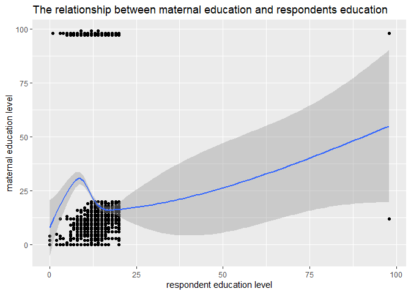
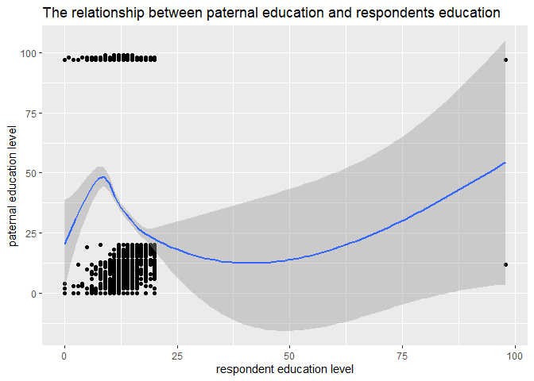
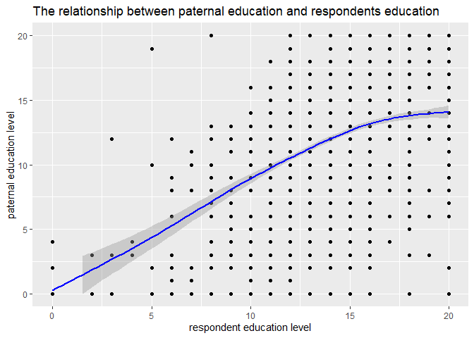

Data Visualization
================
Elamathi Elangovan
2022-08-09

#### Exploring the correlation between parental education level and the education level of their children.

### Research Question

Does higher parental education levels correlate to a higher level of
education in their offspring?

## Data origins

This data is taken from the 2014 General Society Survey (GSS) Merged
Single-Year Data Set. This data set, collected in 2014, looked at adults
in the United States of America, with a sample size of 3842. The data
set contained 3842 rows and 1001 columns.

It includes variables on topics such as marital status, labor force
status, number of hours worked, occupational prestige, divorce status,
level of education and similar data for their mothers and fathers.

The following work considers this data set and looks at educational
correlates, exploring whether there is a relationship between parental
education and that of the respondents.

The data used was provided as a zip file link from
<https://gss.norc.org/get-the-data/spss> provided in the module guide
tomstafford.github.io .

``` r
knitr::opts_chunk$set(fig.path='Figs/')
```

## Look at Data

``` r
library(haven)
```

    ## Warning: package 'haven' was built under R version 4.1.3

``` r
library(gapminder)
```

    ## Warning: package 'gapminder' was built under R version 4.1.3

``` r
library(ggplot2)
library(tidyr)
library(tidyverse)
```

    ## -- Attaching packages --------------------------------------- tidyverse 1.3.1 --

    ## v tibble  3.1.6     v dplyr   1.0.8
    ## v readr   2.1.2     v stringr 1.4.0
    ## v purrr   0.3.4     v forcats 0.5.1

    ## -- Conflicts ------------------------------------------ tidyverse_conflicts() --
    ## x dplyr::filter() masks stats::filter()
    ## x dplyr::lag()    masks stats::lag()

``` r
library(socviz)
```

    ## Warning: package 'socviz' was built under R version 4.1.3

``` r
library(readr)
library(dplyr)


gss2014merged_r10_spss <- read_csv("gss2014merged_r10 - spss.csv")
```

    ## Rows: 3842 Columns: 1001

    ## -- Column specification --------------------------------------------------------
    ## Delimiter: ","
    ## dbl (1001): o;?year, id, wrkstat, hrs1, hrs2, evwork, wrkslf, wrkgovt, OCC10...
    ## 
    ## i Use `spec()` to retrieve the full column specification for this data.
    ## i Specify the column types or set `show_col_types = FALSE` to quiet this message.

``` r
View(gss2014merged_r10_spss)

# df <- read_sav("//studata05/home/PC/Pcp21ed/ManW10/Desktop/gss2014merged_r10 - spss.sav")

nrow(gss2014merged_r10_spss)
```

    ## [1] 3842

## Data wrangling

``` r
educ = gss2014merged_r10_spss$educ
maeduc = gss2014merged_r10_spss$maeduc
paeduc = gss2014merged_r10_spss$paeduc

gss2014merged_r10_spss <- gss2014merged_r10_spss %>%
  select(educ, paeduc, maeduc)
head(gss2014merged_r10_spss)
```

    ## # A tibble: 6 x 3
    ##    educ paeduc maeduc
    ##   <dbl>  <dbl>  <dbl>
    ## 1    16     97      9
    ## 2    16     16     14
    ## 3    13     97     12
    ## 4    16     12     12
    ## 5    17      8     17
    ## 6    17     16     14

## Plot a scatterplot

``` r
p <- ggplot(data = gss2014merged_r10_spss, mapping = aes(x = educ, y = maeduc))
p + geom_point() + geom_smooth() + labs(x = "respondent education level",
                          y = "maternal education level", 
                      title = "The relationship between maternal education and respondents education")
```

    ## `geom_smooth()` using method = 'gam' and formula 'y ~ s(x, bs = "cs")'

<!-- -->

``` r
q <- ggplot(gss2014merged_r10_spss, aes(x = educ, y = paeduc))
q + geom_point() + geom_smooth() + labs(x = "respondent education level",
                                        y = "paternal education level", 
                                        title = "The relationship between paternal education and respondents education")
```

    ## `geom_smooth()` using method = 'gam' and formula 'y ~ s(x, bs = "cs")'

<!-- -->

``` r
p <- ggplot(data = gss2014merged_r10_spss, mapping = aes(x = educ, y = maeduc))
p + geom_point() + geom_smooth(color = "Red") + xlim(c(0,20)) +ylim(c(0,20)) +labs(x = "respondent education level",
                          y = "maternal education level", 
                      title = "The relationship between maternal education and respondents education")
```

    ## `geom_smooth()` using method = 'gam' and formula 'y ~ s(x, bs = "cs")'

    ## Warning: Removed 381 rows containing non-finite values (stat_smooth).

    ## Warning: Removed 381 rows containing missing values (geom_point).

<!-- -->

``` r
q <- ggplot(gss2014merged_r10_spss, aes(x = educ, y = paeduc))
q + geom_point() + geom_smooth(color = "blue") + xlim(c(0,20)) +ylim(c(0,20)) + labs(x = "respondent education level",
                                        y = "paternal education level", 
                                        title = "The relationship between paternal education and respondents education")
```

    ## `geom_smooth()` using method = 'gam' and formula 'y ~ s(x, bs = "cs")'

    ## Warning: Removed 962 rows containing non-finite values (stat_smooth).

    ## Warning: Removed 962 rows containing missing values (geom_point).

<!-- -->

### Notes

In comparing maternal education level with that of the respondent, it
can be deduced that there is a positive, nonlinear association between
the two variables, albeit weak, and the same was seen when paternal
education level was compared with the respondent’s education level. This
suggests a weak positive relationship between parental education level
and that of the respondent, where the higher the education level of the
parent, the higher the education level of their child.

### Summary:

In future projects, it would be interesting to compare the two plots to
determine whether maternal or paternal education level have a stronger
relationship with that of the respondent. It would also be interesting
to compare parental education level to their occupational prestige, as
well as occupation prestige to the respondent’s education level to
further explore factors influencing and involved with education.
